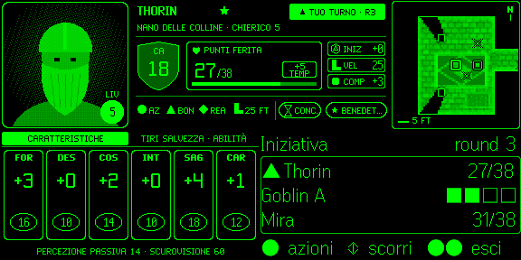

# EvenFoundryVTT

> Play **Dungeons & Dragons 5e** on **FoundryVTT** through **Even Realities G2** AR glasses, controlled with the **Even R1** smart ring — keep your eyes on the table, not on a laptop.

[](#-status)
[](Specs.md)
[](#%EF%B8%8F-license)
[](https://github.com/foundryvtt/dnd5e)
[](https://foundryvtt.com)
[](https://hub.evenrealities.com/docs)

---

## 💡 In one sentence

**EvenFoundryVTT streams your D&D character straight from Foundry to the G2 glasses** — no server to install, no URL to type: Foundry shows a QR code (on your own screen, or the GM's), you scan it with the Even Realities App, and a **D&D-sheet HUD** — portrait, AC shield, HP box, ability scores, a square tactical map — stays in your field of view while one context panel follows the action.

## 📦 Installation

There is **one** thing to install: the Foundry module. It also serves the glasses app.

1. **Foundry** → *Setup* → *Add-on Modules* → *Install Module* → Manifest URL:

   ```
   https://github.com/Aiacos/EvenFoundryVTT/releases/latest/download/module.json
   ```

   Same URL works on **The Forge** (Bazaar → *+ Install Module from a Manifest*). Requires dnd5e ≥ 5.3.3; `midi-qol` is optional (full attack → damage → save automation when present). `socketlib` is no longer required.
2. Foundry must be reachable from the phone over **valid HTTPS** (Let's Encrypt, Tailscale, a reverse proxy — self-signed LAN certificates are rejected by the phone WebView). See [`docs/setup-guide.md`](docs/setup-guide.md).
3. Enable the module in your world.

> **Upgrading from v0.1.x (bridge era, ≤ `v0.1.55`)?** Stop and remove the `evf-bridge` container / Docker Compose stack and the static G2 app host — they are no longer used. Bearer tokens are gone: re-pair every pair of glasses from the *Players* list (see Usage). Nothing else changes in your world.

> Developing? Symlink `packages/foundry-module/` into `Data/modules/evenfoundryvtt/` and run `pnpm --filter @evf/g2-app build && pnpm --filter @evf/foundry-module build`.

### Releases and the Even Hub package

Each GitHub Release (tag `vX.Y.Z`, cut by `scripts/release-tag.mjs` → `foundry-module-release.yml`) ships `module.json` + `evenfoundryvtt.zip` — the zip **includes the glasses app** in `g2/` — plus the Even Hub **`.ehpk`** of the same build. The last bridge-era release is `v0.1.55`; the first direct-streaming release is **v0.2.0**. Full guide: [`docs/release/foundry-module.md`](docs/release/foundry-module.md).

Players don't need the `.ehpk`: the Even Realities App loads the glasses app straight from your Foundry via the pairing QR (sideload, same mechanism as `evenhub qr` dev mode — no expiry). Don't hand out a portal **trial upload**: those **expire** ("trial version expired"); a permanent Even Hub listing needs a manual portal submission (the Even Hub CLI has no submit command). Details: [`docs/release/evenhub.md`](docs/release/evenhub.md) · wiki [Release](https://github.com/Aiacos/EvenFoundryVTT/wiki/Release).

## 🕹️ Usage

| Who | Where | What |
|---|---|---|
| GM (once) | *Configure Settings* → *EvenFoundryVTT* → **Pair G2 glasses** → *Players' glasses* → **Enable glasses for players** | creates a "&lt;Player&gt; (G2)" user per player and seals its password for that player's public key ([ADR-0017](docs/architecture/0017-player-owned-glasses-hybrid-projector.md)) |
| Player | own Foundry → *Configure Settings* → *EvenFoundryVTT* → **Pair my glasses** (or right-click own name in *Players*) | the player's browser creates the device key and shows the QR — no GM needed |
| GM (on behalf) | Foundry sidebar → *Players* → right-click a player → **Pair G2 glasses** (or *Configure Settings* → *EvenFoundryVTT*) | player + character preselected → a QR appears (valid 5 min, single use); the dialog turns to *Glasses connected* on success. For players without Foundry open |
| Player | Even Realities App → **scan the QR** | the glasses app opens already connected to that character |
| Player | R1 ring / temple touchpad | tap = actions · swipe = move cursor · double-tap = back (exit at root) — see [Controls](#-controls--r1-ring--g2-touchpad) |

Each "(G2)" user has the Player role and owns only that character; every device has its own encryption key. **Hybrid projector:** while the player has Foundry open, the player's own client serves the glasses (actions run as that player); otherwise an online GM that holds the device key takes over. Revoke any device from the pairing dialog. A **manual code** fallback is shown under the QR. Step-by-step guides (Italian): **[project wiki](https://github.com/Aiacos/EvenFoundryVTT/wiki)**.

## 🕹️ Controls — R1 ring / G2 touchpad

Four gestures drive everything (canonical model: [ADR-0012](docs/architecture/0012-r1-gesture-model-overscroll-exit-lifecycle.md), Amendment 2 — the menu opens on **tap**; implemented by [ADR-0018](docs/architecture/0018-dnd-sheet-hud-pixel-renderer.md)). All input lands on the context panel (zone E); the other zones update by themselves.

| Physical gesture | SDK event | At the base view | In a list (actions, targets, spells, …) |
|---|---|---|---|
| **Press** (tap) | `CLICK_EVENT (0)` | open the **Actions** menu | confirm the highlighted entry |
| **Swipe up / down** | `SCROLL_TOP_EVENT (1)` / `SCROLL_BOTTOM_EVENT (2)` | scroll the log | move the ▶ cursor |
| **Double-press** | `DOUBLE_CLICK_EVENT (3)` | **exit** (`shutDownPageContainer(1)`) | back / cancel |
| Long-press *(optional)* | `LONG_PRESS_EVENT (9)`, SDK ≥ 0.0.14, Even App ≥ 2.2.9 | shortcuts menu — every entry is also reachable by tap | — |

GM roll requests switch the sheet to *Saves & Skills* and tell you to roll the physical d20; at 0 HP the sheet shows death saves.

## 🧪 Try it on the glasses

```bash
pnpm wizard                      # demo scenes on your LAN + QR (no Foundry needed)
pnpm wizard --foundry https://your-foundry.example   # checks your Foundry + QR of the app it serves
```

On the phone: sign in once at [hub.evenrealities.com/login](https://hub.evenrealities.com/login) (that enables Developer Mode), reopen the Even Realities App, then **Even Hub → Scan QR**. Details: [`docs/release/evenhub.md`](docs/release/evenhub.md) — including why the app is QR-sideloaded rather than listed on the Even Hub store.

## 👓 UX / UI design

The HUD reads like the paper 5e sheet and D&D Beyond (**"Scheda da tavolo G2"**): five fixed zones on the 576 × 288 canvas — four pixel-drawn zones and one firmware-text panel, the only one that takes input. The page uses the **hardware-proven 2×2 grid of 288 × 144 image tiles** (the real G2 host rejects image tiles at off-grid offsets, which the simulator accepts): the 576 × 144 top band (portrait · header · map) is rendered once and split at x = 288 into two tiles, the sheet is the tile at (0, 144), and the context panel is text at the bottom-right — 3 / 4 image + 4 / 8 text containers ([Specs §7.0](Specs.md)).

| Zone | Area | Shows |
|---|---|---|
| A · Portrait | 144 × 144, top-left (tile 1) | actor image → token → class emblem, dimmed at 0 HP |
| B · Header | 288 × 144, top-centre (across tiles 1–2) | AC shield, HP box + temp + bar, INIT · SPD · PROF, ● Action ▲ Bonus ◆ Reaction + movement, conditions, ▲ YOUR TURN |
| C · Map | 144 × 144, top-right (tile 2) | the scene's **original art** (background, tiles, token art) pixelated and dithered to 16 greens, darkness outside your token's sight, vector markers on top; centred on your token, ≤ 1 fps |
| D · Sheet | 288 × 144, bottom-left (tile 3) | Abilities · Saves & Skills pages; death saves at 0 HP |
| E · Context | 288 × 144, bottom-right (firmware text) | log, initiative, actions, targets, spells, results, reactions |


*Exploration (S1): abilities page, recent log in the context panel.*


*Combat, your turn (S2): action economy and ▲ TUO TURNO in the header, initiative in the context panel.*


*GM roll request (S8): the sheet flips to Saves & Skills; you roll the physical d20.*

Real simulator screenshots (all 12 screens in [`docs/design/img/`](docs/design/img/)). The full design — brief, principles, zones and SDK budget, visual language, gestures, edge cases — is **[`docs/design/g2-sheet-ux.html`](docs/design/g2-sheet-ux.html)**; the executable INV-1 contract is the per-zone pixel fixtures in `packages/shared-render/src/fixtures/sheet.*.txt`.

## 🏗️ Architecture

```
[ G2 glasses ] ⇄ BLE ⇄ [ Even App WebView — page served by Foundry: /modules/evenfoundryvtt/g2/ ]
                                  │ same-origin HTTPS: /join + socket.io
                                  ▼
                          [ Foundry server ] ── relays module.evenfoundryvtt (AES-GCM sealed)
                                  │
                                  ▼
   [ projector = player's browser when online · else a GM browser ]
     evenfoundryvtt module: dnd5e readers · write path (activity.use / MidiQOL) · pairing
```

No bridge, no Docker, no extra origin. Decision record: **[ADR-0016](docs/architecture/0016-direct-foundry-streaming.md)** (supersedes the bridge-era map capture of ADR-0015; the player-owned pairing of [ADR-0017](docs/architecture/0017-player-owned-glasses-hybrid-projector.md) supersedes the bearer tokens of ADR-0014). A projector client must be online — the player's own Foundry client, or a GM holding the device key ([ADR-0017](docs/architecture/0017-player-owned-glasses-hybrid-projector.md)); it computes dnd5e derived data and is the only client that executes that device's actions ([ADR-0011](docs/architecture/0011-foundry-write-path-single-workflow-origin.md)).

## ✨ Highlights

- **Zero infrastructure** — the glasses app is shipped inside the Foundry module and QR-sideloaded; same-origin means no CORS, no whitelist, no cookies blocked (works on Foundry v13 and v14).
- **Private by design** — Foundry relays module messages to every client, so every payload is **AES-256-GCM sealed** with a per-device key held only by the phone and the projector clients; the QR is single-use (the key rotates on first connect).
- **Reads like your character sheet** — AC shield, HP box, ability boxes and proficiency circles drawn by our own pixel renderer and bitmap fonts (the firmware font has no D&D glyphs); pages switch automatically (Saves & Skills on a GM roll request, death saves at 0 HP).
- **Player-owned glasses** — the GM enables players once; each player pairs from their own Foundry, and their client is the projector while online, with the GM as fallback. Keys travel sealed with ECDH P-256 ([ADR-0017](docs/architecture/0017-player-owned-glasses-hybrid-projector.md)).
- **Pixelated original map** — the phone fetches the scene art (background, tiles, token art) same-origin, block-downsamples it (pixel size 1/2/3, default 2), Floyd–Steinberg dithers it to 16 greens, blacks out what your token can't see (12 cells when the token has no sight radius) and draws crisp markers on top; one square 144 × 144 image centred on your token, sent only when it changes (≤ 1 fps), paced to the SDK's 100 ms image limit ([ADR-0018](docs/architecture/0018-dnd-sheet-hud-pixel-renderer.md)).
- **Battle-tested Foundry calls** — fixes found live on real Foundry/dnd5e in the v0.9.14 → v0.11 line are kept: `Activity#use(usage, dialog, message)` with `configure: false` in the *dialog* argument (no 10 s hang), null temp HP, dnd5e 5.1 spell preparation, zero-quantity items, bounded audit log, skill checks.
- **Dual D&D edition** — PHB 2014 and PHB 2024 via `core.modernRules`.
- **IT + EN** — follows Foundry's language, overridable from the phone page or the glasses menu.

## 🛡️ Invariants & principles

Four non-negotiable invariants ([`Specs.md` §0.1](Specs.md)) — **INV-1** layout integrity · **INV-2** online cross-validation · **INV-3** documentation coherence · **INV-4** code quality — plus the Engineering Constitution (P1–P11) in [`CLAUDE.md`](CLAUDE.md).

## 📊 Status

**v0.12.0 — direct streaming, ported onto `develop`.** The Node bridge, the `foundry-mcp` server and Docker Compose are removed ([ADR-0016](docs/architecture/0016-direct-foundry-streaming.md)); glasses are player-owned ([ADR-0017](docs/architecture/0017-player-owned-glasses-hybrid-projector.md)); the G2 app is the D&D-sheet HUD on our pixel renderer ([ADR-0018](docs/architecture/0018-dnd-sheet-hud-pixel-renderer.md)) on Even Hub SDK 0.0.15. The bridge-era history (v0.9.14 → v0.11.0, releases up to `v0.1.55`) is kept in git and in the [`Specs.md`](Specs.md) changelog, together with its real-hardware lessons. Hardware verification (QR sideload, cookie persistence, 2×2 tile geometry, BLE map pacing) follows the defer-hardware pattern: `pnpm --filter @evf/validation-harness validate:direct-sideload`. Planning uses Spec Kit — this feature is [`specs/003-direct-streaming/`](specs/003-direct-streaming/).

## 🗺️ Roadmap

| Milestone | Status | Scope |
|---|---|---|
| v0.9.11 → v0.9.13 | ✅ shipped | MVP, quick wins, sheet data (bridge-based) |
| v0.9.14 → v0.11.0 | ✅ shipped, superseded | bridge-era raster HUD substrates, bearer pairing, player-view map capture — releases up to `v0.1.55` |
| **v0.12.0** | 🚧 current | direct Foundry → G2 streaming, player-owned glasses, D&D-sheet HUD on the 2×2 tile grid, pixelated original-art map — release `v0.2.0` |
| next | planned | hardware UAT on G2 + R1; skill/save rolls from the glasses; voice/MCP as a client of the direct channel (new ADR) |

## 🥽 Hardware

- **Even Realities G2** — 576 × 288 px, 4-bit greyscale green; ≤ 4 image (20–288 × 20–144 each, on the (0,0)-anchored grid on real hardware) + ≤ 8 text/list containers per page; 4-mic array; no speaker, no camera. *([display](https://hub.evenrealities.com/docs/build/display) · [device APIs](https://hub.evenrealities.com/docs/build/device-apis))*
- **Even Realities R1** — BLE ring: press, double-press, swipe up/down; long-press only as an optional extra (SDK ≥ 0.0.14, Even App ≥ 2.2.9). *([ring](https://www.evenrealities.com/smart-ring))*
- **FoundryVTT** ≥ v13.347 (v14 verified) + **dnd5e** ≥ 5.3.3, reachable over HTTPS.

## 🧰 Stack

- **G2 app**: TypeScript + Vite 8, `@evenrealities/even_hub_sdk` 0.0.15, `socket.io-client` 4.8, `@evenrealities/pretext` (pixel text budgets), `upng-js` (4-bit PNG); map pixelation + Floyd–Steinberg dither in plain TypeScript
- **Foundry module**: dnd5e 5.x readers + write path, optional MidiQOL, `qrcode`
- **Shared**: `@evf/shared-protocol` (Zod schemas + WebCrypto sealed envelope + ECDH P-256 sealing), `@evf/shared-render` (4-bit pixel renderer + bitmap fonts, INV-1 fixtures)
- **Tooling**: pnpm workspaces · Vitest · Biome · TypeScript strict · Changesets · GitFlow

## 📚 Documentation

- **[Project wiki](https://github.com/Aiacos/EvenFoundryVTT/wiki)** (Italian) — player, GM and developer guides; source in [`docs/wiki/`](docs/wiki/)
- [`Specs.md`](Specs.md) — canonical specification (v0.12.0)
- [`docs/design/g2-sheet-ux.html`](docs/design/g2-sheet-ux.html) — D&D-sheet HUD design (zones, principles, gestures, 12 screens)
- [`docs/design/g2-thirds-layout.md`](docs/design/g2-thirds-layout.md) — superseded thirds layout (history); its pairing flow and phone mocks P01–P03 are still current
- [`docs/architecture/`](docs/architecture/) — ADRs 0001–0018 (current: 0011 write path · 0012 R1 gestures · 0016 direct streaming · 0017 player-owned glasses · 0018 D&D-sheet HUD; index with statuses in [`docs/architecture/README.md`](docs/architecture/README.md))
- [`specs/`](specs/) — Spec Kit features (`003-direct-streaming` is this port)
- [`docs/setup-guide.md`](docs/setup-guide.md) · [`docs/runbook.md`](docs/runbook.md) · [`docs/showcase/index.html`](docs/showcase/index.html)

## 🎨 Inspiration

- **DOOM on a watch** ([jborza](https://jborza.com/post/2020-11-20-doom-on-a-watch/)) · **Ditherpunk** ([surma.dev](https://surma.dev/things/ditherpunk/)) · **FoundryVTT desktop** persistent character card

## ⚖️ License

MIT — every package in the monorepo (`foundry-module`, `g2-app`, `shared-protocol`, `shared-render`, `validation-harness`).

## 👤 Author

Lorenzo (a.k.a. **Aiacos**) — `uni.lorenzo.a@gmail.com`

> *"The player never looks away from the table."*
