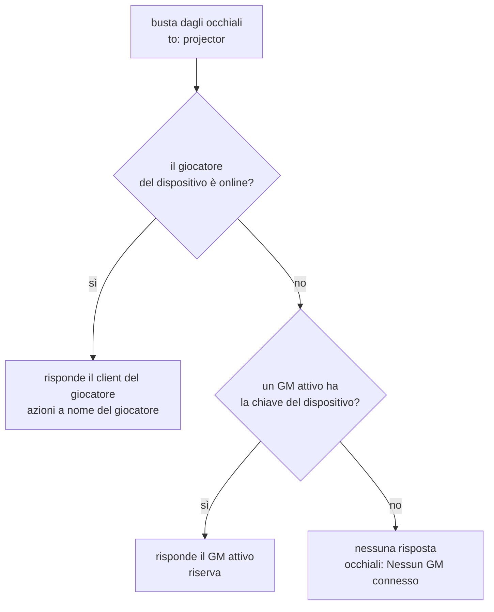
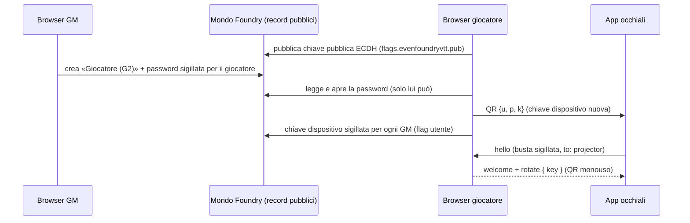

# Architettura

Dalla v0.10.0 **non c'è un server nostro**: l'app degli occhiali è servita da Foundry, parla con Foundry sulla stessa origine e un client Foundry fa da **projector** ([ADR-0012](Decisioni-Architetturali)). Con [ADR-0013](Decisioni-Architetturali) il projector è **ibrido**: il client del giocatore quando è online, altrimenti un GM.

## 🏗️ Vista d'insieme

```
[ G2 ] ⇄ BLE ⇄ [ Even App WebView — pagina servita da Foundry: /modules/evenfoundryvtt/g2/ ]
                          │ HTTPS stessa origine: POST /join (cookie) + socket.io
                          ▼
                  [ Server Foundry ] ── inoltra module.evenfoundryvtt (buste AES-GCM) a tutti i client
                    │                                   │
                    ▼                                   ▼
   [ Browser del giocatore = projector ]     [ Browser GM = projector di riserva ]
     quando il giocatore è online              quando il giocatore è offline
     readers dnd5e · dispatchTool              readers dnd5e · dispatchTool
```

- **La G2 è un thin client**: display, microfoni, IMU e touchpad; il codice gira nella WebView del telefono, non nel firmware ([architettura Even Hub](https://hub.evenrealities.com/docs/get-started/architecture)).
- **La pagina** è la build di `packages/g2-app`, emessa in `packages/foundry-module/g2/` e distribuita nello zip del modulo.
- **Il trasporto** è il relay socket dei moduli Foundry, che inoltra ogni messaggio a *tutti* i client ⇒ ogni messaggio è una busta sigillata ([Protocollo](Protocollo)).
- **Il projector** calcola i dati derivati di dnd5e (CA, modificatori, slot) — esistono solo dentro un client Foundry completo — ed esegue le azioni.

## 🏗️ Elezione del projector (per dispositivo)

Gli occhiali scrivono sempre all'indirizzo logico **`projector`**; le risposte sono sigillate *da* `projector`, quindi i dati autenticati `from>to` non dipendono da quale client ha risposto.



- **Solo il client eletto esegue `invoke`**: un'origine per dispositivo alla volta ([ADR-0011](Decisioni-Architetturali) emendato da ADR-0013, invariante **INV-6**). Il client non eletto ignora il messaggio.
- Nella breve finestra di passaggio online/offline possono rispondere due client: la regola «solo l'eletto esegue `invoke`», il `rid` usato come chiave di idempotenza e il timeout con nuovo tentativo dell'app coprono il caso.

## 🔐 Custodia delle chiavi (ADR-0013)



1. Ogni client partecipante (giocatori e GM) ha una coppia **ECDH P-256**: privata in `scope:'client'`, pubblica nei propri flag utente.
2. Il GM **abilita una volta**: crea gli utenti «(G2)» e sigilla le password per le chiavi pubbliche dei giocatori.
3. Il giocatore genera la **chiave del dispositivo**, mostra il QR e la **sigilla per ogni GM**, così qualunque GM (anche un browser nuovo, dopo aver pubblicato la propria chiave) può fare da riserva.
4. La costruzione è ECIES: chiave effimera → `ECDH` → `HKDF-SHA256` (info `evf-seal-v1|<contesto>`) → `AES-256-GCM` con il contesto come AAD (es. `pw:<g2UserId>`, `dk:<g2UserId>:<gmUserId>`): un blob copiato in un altro record non si apre.

## 🏗️ Pacchetti del monorepo

| Pacchetto | Ruolo |
|---|---|
| [`packages/foundry-module`](https://github.com/Aiacos/EvenFoundryVTT/tree/develop/packages/foundry-module) | modulo `evenfoundryvtt`: projector (`src/direct/projector.ts`), associazione (`pairing-flow.ts`, `PairG2App.ts`, `players-menu.ts`), utenti «(G2)» (`g2-user.ts`), lettura della scena (`map-reader.ts`), readers dnd5e (`src/readers/`), write path (`src/write-path/`) |
| [`packages/g2-app`](https://github.com/Aiacos/EvenFoundryVTT/tree/develop/packages/g2-app) | app degli occhiali: sessione e client Foundry (`src/direct/`), HUD (`src/hud/`: zone, testo, input, arte della mappa), pagina telefono (`src/phone/`), demo e debug (`src/demo/`, `src/debug/`) |
| [`packages/shared-protocol`](https://github.com/Aiacos/EvenFoundryVTT/tree/develop/packages/shared-protocol) | schemi Zod e crittografia WebCrypto del canale diretto (`src/direct/`: messaggi, busta, associazione, ECDH, `MapSnapshot`) |
| [`packages/shared-render`](https://github.com/Aiacos/EvenFoundryVTT/tree/develop/packages/shared-render) | renderer a pixel 4-bit, font bitmap, icone D&D, fixture INV-1 ([Renderer a pixel](Renderer-Pixel)) |
| [`packages/validation-harness`](https://github.com/Aiacos/EvenFoundryVTT/tree/develop/packages/validation-harness) | verifiche GO/NO-GO hardware e degli invarianti (`validate:*`, `inv:all`) |

## 🏗️ Flusso di un'azione

gesto sull'R1 → `toGestureEvent` → riduttore della zona E → `invoke` sigillato su `module.evenfoundryvtt` → relay Foundry → **projector eletto** → `dispatchTool` → handler del write path → `MidiQOL.completeActivityUse` (se midi-qol è attivo) oppure `activity.use()` → hook Foundry → `delta` sigillato → HUD.

Il gate CI 8 rifiuta qualsiasi `activity.use(` fuori da `packages/foundry-module/src/write-path/` ([Test e qualità](Test-e-Qualita)).

## 📚 Vedi anche

- [Protocollo](Protocollo) · [Renderer a pixel](Renderer-Pixel) · [Decisioni architetturali](Decisioni-Architetturali)
- `Specs.md` §2.0: [Direct Streaming Architecture](https://github.com/Aiacos/EvenFoundryVTT/blob/develop/Specs.md#20-direct-streaming-architecture-v0100--canonico)
