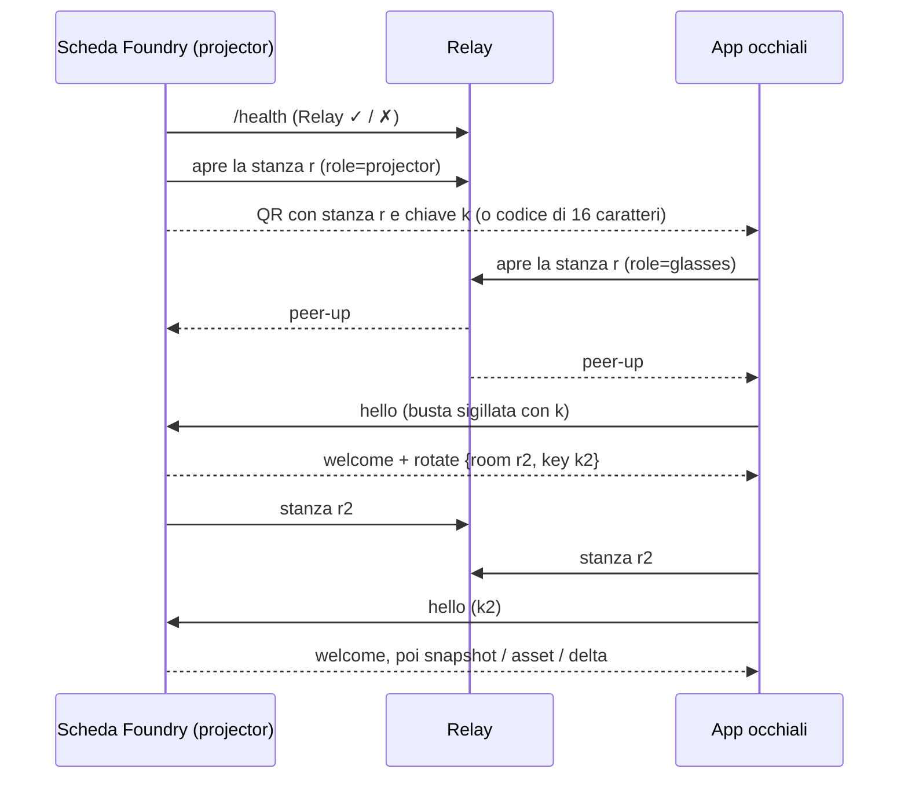

# Architettura

Dalla v0.13.0 ([ADR-0019](Decisioni-Architetturali)) il **telefono non accede mai a Foundry**. La scheda di Foundry di chi ha mostrato il QR — di solito il giocatore — è il **projector** dei suoi occhiali; occhiali e projector si parlano attraverso un **relay** opaco che inoltra buste cifrate senza leggerle. Restano dall'[ADR-0016](Decisioni-Architetturali) la busta sigillata e il ruolo del projector, dall'[ADR-0011](Decisioni-Architetturali) l'origine unica delle azioni e dall'[ADR-0018](Decisioni-Architetturali) la HUD.

## 🏗️ Vista d'insieme

```
[ G2 + R1 ] ⇄ BLE ⇄ [ telefono: app «FoundryVTT G2 HUD» (Even Hub · GitHub Pages /app/ · Vite) ]
                                   │ wss://…/r/<stanza>?role=glasses
                                   ▼
                  [ relay evf-relay — Cloudflare Worker + Durable Object per stanza ]
                    inoltra frame opachi · una connessione per ruolo · non salva niente
                                   ▲
                                   │ wss://…/r/<stanza>?role=projector
   [ scheda Foundry del giocatore = projector: readers dnd5e · dispatchTool · asset della mappa ]
```

- **La G2 è un thin client**: display, microfoni, IMU e touchpad; il codice gira nella WebView del telefono, non nel firmware ([architettura Even Hub](https://hub.evenrealities.com/docs/get-started/architecture)).
- **L'app** è un solo bundle (`packages/g2-app/dist`) distribuito in tre modi: pacchetto **Even Hub** (giocatori), **GitHub Pages** `/app/` (la pagina che il QR apre in modalità sviluppatore), **Vite** in sviluppo ([Release](Release)).
- **Il relay** (`packages/relay`) instrada `GET /r/<stanza>?role=projector|glasses` verso un Durable Object per stanza (WebSocket Hibernation: le stanze inattive non costano). Una connessione per ruolo (la più nuova sostituisce la vecchia, codice `4000`), frame di controllo `{"relay":"peer-up"}` / `{"relay":"peer-down"}`, frame fino a 1 MiB e 60 al secondo. Vede id della stanza, orari e dimensioni, **mai il contenuto** ([Protocollo](Protocollo)).
- **Il projector** calcola i dati derivati di dnd5e (CA, modificatori, slot) — esistono solo dentro un client Foundry completo — ed esegue le azioni con i permessi del suo utente.

## 🏗️ Il projector

- È la scheda che ha **mostrato il QR**: il giocatore dal proprio Foundry, oppure un GM per un giocatore senza dispositivo ([Collegare per un giocatore](Abilitare-i-Giocatori)). Non ci sono elezioni né GM di riserva.
- Il collegamento (stanza + chiave) è salvato **solo in quel browser** (impostazione nascosta `scope: 'client'`): niente sul server, niente al GM. Ogni volta che quel browser apre Foundry, il modulo riapre la connessione al relay e gli occhiali si ricollegano da soli.
- Un **Web Lock** per dispositivo: con più schede aperte nello stesso browser ne trasmette una sola; se si chiude, subentra un'altra.
- A ogni richiesta ricontrolla dal vivo che il suo utente sia ancora proprietario del personaggio (`forbidden_actor` altrimenti, con audit).

## 🔐 Collegamento



- Il QR è `https://aiacos.github.io/EvenFoundryVTT/app/#c=<CODICE>` (circa 63 caratteri): porta solo il codice di 16 caratteri, da cui stanza e chiave derivano con HKDF-SHA256; `&relay=` compare solo in sviluppo o con un relay self-hosted.
- QR e codice sono **monouso** (rotazione al primo `welcome`) e **scadono in 5 minuti**.
- Se il projector esce dalla stanza, gli occhiali ricevono `peer-down` e mostrano **«Foundry del giocatore chiuso»** (causa `no-projector`) tenendo aperta la connessione: al `peer-up` successivo ripartono da soli. Le altre cause offline sono `network` (*Relay non raggiungibile*) e `background`.
- Passi di S11: relay raggiungibile → Foundry del giocatore aperto → collegato a «&lt;utente&gt;» → scheda → scena.

## 🗺️ Asset della mappa

Il telefono non può scaricare l'arte da Foundry (non ci accede), quindi la carica **il projector**, che è già dentro il gioco: stessa origine, oppure il CDN di The Forge con CORS. Ogni immagine viene ridotta **una volta** — sfondo in JPEG con lato ≤ 768 px, tile e token in PNG con lato ≤ 128 px — e inviata come messaggio `asset` (`data:` URL) prima dello snapshot che la cita come `evf-asset:<id>`. Sul telefono la pixelatura e il dithering non cambiano ([Mappa](Mappa)). Un'immagine che non si carica viene saltata; senza sfondo resta la mappa schematica.

## 🏗️ Pacchetti del monorepo

| Pacchetto | Ruolo |
|---|---|
| [`packages/foundry-module`](https://github.com/Aiacos/EvenFoundryVTT/tree/develop/packages/foundry-module) | modulo `evenfoundryvtt`: projector (`src/direct/projector.ts`, `relay-connection.ts`), collegamento (`pairing-flow.ts`, `pairing-store.ts`, `PairG2App.ts`, `players-menu.ts`), scena e asset (`map-reader.ts`, `map-assets.ts`), readers dnd5e (`src/readers/`), write path (`src/write-path/`) |
| [`packages/g2-app`](https://github.com/Aiacos/EvenFoundryVTT/tree/develop/packages/g2-app) | app degli occhiali: sessione e client del relay (`src/direct/`), HUD (`src/hud/`), pagina telefono con «Scansiona QR» (`src/phone/`), demo e debug (`src/demo/`, `src/debug/`) |
| [`packages/relay`](https://github.com/Aiacos/EvenFoundryVTT/tree/develop/packages/relay) | relay a stanze: Cloudflare Worker + Durable Object (`src/room.ts`, `src/routing.ts`, `src/limits.ts`) |
| [`packages/shared-protocol`](https://github.com/Aiacos/EvenFoundryVTT/tree/develop/packages/shared-protocol) | schemi Zod e crittografia WebCrypto del canale (`src/direct/`: messaggi, busta, collegamento, relay, `MapSnapshot`) |
| [`packages/shared-render`](https://github.com/Aiacos/EvenFoundryVTT/tree/develop/packages/shared-render) | renderer a pixel 4-bit, font bitmap, icone D&D, fixture INV-1 ([Renderer a pixel](Renderer-Pixel)) |
| [`packages/validation-harness`](https://github.com/Aiacos/EvenFoundryVTT/tree/develop/packages/validation-harness) | verifiche GO/NO-GO hardware e degli invarianti (`validate:relay`, `validate:*`, `inv:all`) |

## 🏗️ Flusso di un'azione

gesto sull'R1 → `toGestureEvent` → riduttore della zona E → `invoke` sigillato → relay → **projector** → `dispatchTool` → handler del write path → `MidiQOL.completeActivityUse` (se midi-qol è attivo) oppure `activity.use()` → hook Foundry → `delta` sigillato → relay → HUD.

Il gate CI 8 rifiuta qualsiasi `activity.use(` fuori da `packages/foundry-module/src/write-path/` ([Test e qualità](Test-e-Qualita)).

## 📚 Vedi anche

- [Protocollo](Protocollo) · [Renderer a pixel](Renderer-Pixel) · [Decisioni architetturali](Decisioni-Architetturali)
- [ADR-0019](https://github.com/Aiacos/EvenFoundryVTT/blob/develop/docs/architecture/0019-relay-pairing-player-projector.md) · [`Specs.md`](https://github.com/Aiacos/EvenFoundryVTT/blob/develop/Specs.md)
