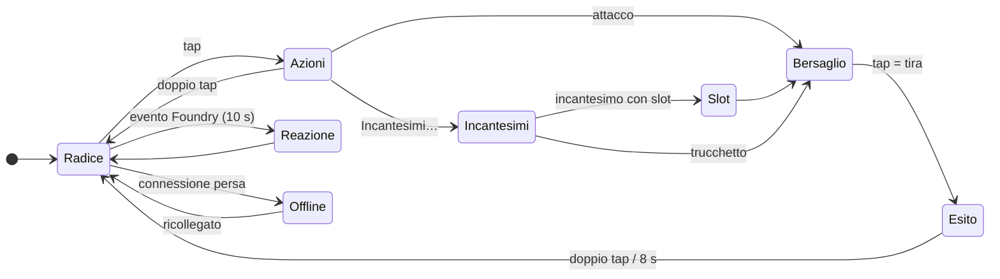

# Gesti e comandi

Gli occhiali si comandano con l'anello **R1** o con il touchpad sulla **tempia** della G2. I gesti ufficiali sono **tap**, **doppio tap** e **swipe su/giù**; la **pressione lunga** esiste dall'SDK 0.0.14 con Even App ≥ 2.2.9 ed è solo un **extra** ([device APIs](https://hub.evenrealities.com/docs/build/device-apis) · [menu contestuale](https://hub.evenrealities.com/docs/build/contextual-menu) · [anello](https://www.evenrealities.com/smart-ring)). Ogni gesto agisce sempre sul **pannello contesto** (zona E) e significa la stessa cosa ovunque.

## 🕹️ Tabella dei gesti

| Gesto | Sulla radice | In una lista | Su un esito | Offline (S12) |
|---|---|---|---|---|
| **Tap** | apre **Azioni** | conferma la voce sotto **▶** | torna ad **Azioni** | **riprova ora** |
| **Swipe su / giù** | scorre registro o iniziativa | sposta il cursore **▶** | — | — |
| **Doppio tap** | **esce dall'app** (obbligo Even Hub) | indietro di un livello | chiude | esce |
| **Pressione lunga** | menu di sistema con le scorciatoie | idem | idem | idem |

Casi speciali del doppio tap: su una **Reazione** vale *Ignora*, su una **Prova richiesta** vale *Chiudi*. Su **Collegamento** (S11) annulla ed esce.

## 🕹️ Menu della pressione lunga

La pressione lunga apre il menu di sistema della pagina (`menuObject`). Ogni voce è raggiungibile **anche col tap** da *Azioni* → *Opzioni…*, quindi la pressione lunga non è mai l'unica strada.

| Voce | Effetto |
|---|---|
| **Scheda** | alterna *Caratteristiche* ↔ *Tiri salvezza · Abilità* |
| **Mappa: zoom +** / **Mappa: zoom -** | cambia la dimensione delle celle della mappa ([Mappa](Mappa)) |
| **Mappa: segui/libera** | la mappa segue il tuo token oppure resta ferma |
| **Vantaggio/Svantaggio** | ciclo *Vantaggio: no* → *Vantaggio: sì* → *Svantaggio* per il prossimo tiro |
| **Fine turno** | termina il turno (rifiutato se non è il tuo turno) |
| **Lingua** | ciclo auto → IT → EN |
| **Riconnetti** | nuova connessione a Foundry |

## 🕹️ Il flusso di un'azione

1. **Radice** — registro (esplorazione) o iniziativa (combattimento).
2. **Azioni** — attacchi con bonus e danni a destra (`+6 · 1d8+3`), poi *Incantesimi…*, *Oggetti…*, *Opzioni…* e, nel tuo turno, *Fine turno*.
3. **Incantesimi** → **Slot** (se l'incantesimo usa slot) → **Bersaglio** (il mirino compare sulla mappa, [S4](Schermate)).
4. **Esito** — *COLPITO* / *MANCATO* / *TS riuscito* / *TS fallito* / *danni inflitti* / *eseguito*; si chiude da solo dopo **8 s**.
5. **Reazione** — quando Foundry offre una reazione (per esempio *Attacco di opportunità*), il pannello mostra la scelta con *scade N s* (al massimo **10 s**).

Gli errori arrivano come esito con il motivo: *nessun bersaglio*, *fuori portata*, *risorse esaurite*, *non è il tuo turno*, *serve concentrazione*, *rifiutato dal GM*.

## 🎲 Tiri di dado

Gli attacchi e gli incantesimi partono da Foundry (con **midi-qol** l'intera sequenza attacco → danni → tiro salvezza è automatica). Le **prove richieste dal GM** invece non si tirano dagli occhiali: Foundry non ha un gestore per il tiro remoto, quindi la scheda passa a *Tiri salvezza · Abilità* e il contesto dice **«Tira il d20 sul tavolo»**; **tap** = *Fatto*.

## 📚 Vedi anche

- [Leggere la HUD](Leggere-la-HUD) · [Schermate](Schermate)
- Riferimento tecnico: invariante INV-5 (determinismo dei gesti) in [`docs/architecture/INVARIANTS.md`](https://github.com/Aiacos/EvenFoundryVTT/blob/develop/docs/architecture/INVARIANTS.md).
