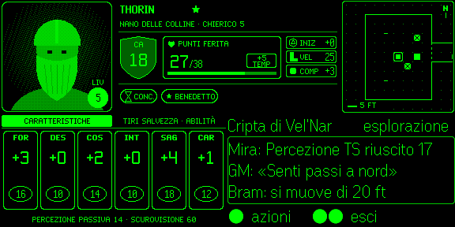

# EvenFoundryVTT — Wiki

> Gioca a **Dungeons & Dragons 5e** su **FoundryVTT** con gli occhiali AR **Even Realities G2** e l'anello **Even R1**: la scheda del tuo personaggio resta nel campo visivo, lo sguardo resta sul tavolo.

## 🎲 Cos'è

EvenFoundryVTT sono due pezzi:

1. il **modulo Foundry** `evenfoundryvtt`, che legge la sessione D&D 5e (personaggio, combattimento, registro, scena) nella **tua** scheda di Foundry ed esegue le azioni che scegli con l'anello;
2. l'**app per gli occhiali «FoundryVTT G2 HUD»**, che gira sul telefono dentro la Even Realities App e disegna la HUD sugli occhiali.

Li unisce un **relay**: un piccolo inoltro WebSocket che passa solo messaggi cifrati e non ne legge nessuno. Il telefono **non accede mai a Foundry**: niente utenti in più, niente password, niente GM di mezzo ([Architettura](Architettura), [ADR-0019](Decisioni-Architetturali)).

```
[ G2 + R1 ] ⇄ BLE ⇄ [ telefono: app «FoundryVTT G2 HUD» ]
                              │ wss:// (buste AES-256-GCM)
                              ▼
                     [ relay evf-relay ] — inoltra, non legge
                              ▲
                              │ wss:// (buste AES-256-GCM)
       [ la TUA scheda di Foundry = projector: dati dnd5e · azioni ]
```

## 💡 Il giro in 30 secondi



*S1 · Esplorazione — screenshot reale dal simulatore Even Hub, 576 × 288 px.*

- **Collegare**: in Foundry tasto destro sul tuo nome › **«Collega occhiali G2»** (o **Alt+G**), sul telefono **«Scansiona QR»**. Fatto una volta, si ricollega da solo ([Collegare i tuoi occhiali](Associare-i-tuoi-Occhiali)).
- **In alto**: ritratto (A), intestazione con scudo **CA**, box **PF**, INIZ · VEL · COMP ed economia d'azione (B), mappa quadrata centrata sul tuo token (C).
- **In basso**: la scheda con le caratteristiche o i tiri salvezza e le abilità (D) e il **pannello contesto** (E), l'unica zona che risponde ai gesti.
- **Con l'anello**: tap = azioni · swipe = sposta il cursore · doppio tap = indietro/esci · pressione lunga = scorciatoie.

## 📚 Da dove partire

| Sei… | Leggi |
|---|---|
| **Giocatore** con gli occhiali | [Guida rapida](Guida-Rapida-Giocatore) → [Collegare i tuoi occhiali](Associare-i-tuoi-Occhiali) → [Leggere la HUD](Leggere-la-HUD) → [Gesti e comandi](Gesti-e-Comandi) → [Mappa](Mappa) → [Schermate](Schermate) |
| **Game Master** | [Installazione](Installazione) → [Rete e relay](HTTPS-e-Rete) → [Collegare per un giocatore](Abilitare-i-Giocatori) → [Scollegare e sicurezza](Revoca-e-Sicurezza) → [Risoluzione problemi](Risoluzione-Problemi) |
| **Sviluppatore** | [Architettura](Architettura) → [Protocollo](Protocollo) → [Renderer a pixel](Renderer-Pixel) → [Debug e simulatore](Debug-e-Simulatore) → [Test e qualità](Test-e-Qualita) → [Release](Release) → [Contribuire](Contribuire) |
| Hai una domanda | [FAQ](FAQ) · [Glossario](Glossario) · [Decisioni architetturali](Decisioni-Architetturali) · [Changelog](Changelog) |

## 🥽 Cosa serve

- **Even Realities G2** + **R1**, associati al telefono con la Even Realities App ([hub.evenrealities.com](https://hub.evenrealities.com/docs)).
- L'app **«FoundryVTT G2 HUD»** da Even Hub (per ora nel gruppo beta del tavolo) ([Installazione](Installazione)).
- **FoundryVTT** ≥ v13.347 (v13 e v14, self-hosted o **The Forge**) con **dnd5e** ≥ 5.3.3 e il modulo **EvenFoundryVTT** installato dal manifest. **Non** serve HTTPS pubblico: basta che la tua scheda di Foundry raggiunga il relay ([Rete e relay](HTTPS-e-Rete)).
- Durante il gioco, la **tua scheda di Foundry aperta** (o quella di un GM che ha collegato gli occhiali per te).

## 📊 Stato

**v0.13.0 — relay e collegamento dal Foundry del giocatore** ([ADR-0019](Decisioni-Architetturali)). La verifica sull'hardware reale (relay da The Forge e da Foundry self-hosted, scansione del QR con la fotocamera su iOS e Android, collegamento che sopravvive a 5 minuti di telefono bloccato) segue il pattern *defer-hardware*: il software è verificato dai test, dal test end-to-end sul relay e dal simulatore ufficiale, l'hardware con `validate:relay` ([Debug e simulatore](Debug-e-Simulatore)). Novità: [Changelog](Changelog).

## ⚖️ Licenza

MIT. Sorgente e issue: [github.com/Aiacos/EvenFoundryVTT](https://github.com/Aiacos/EvenFoundryVTT).
