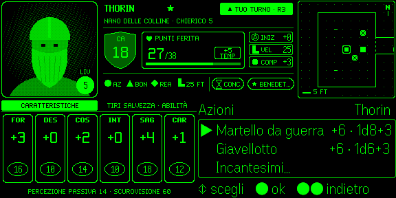
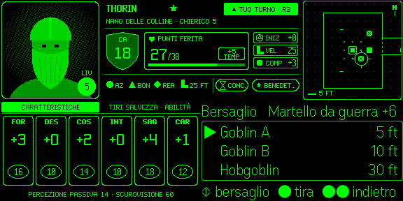
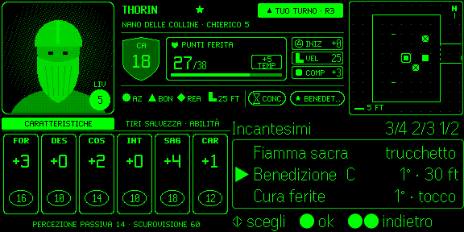
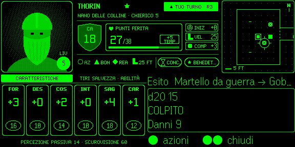
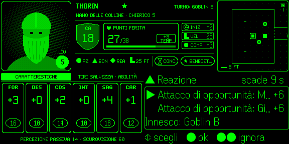
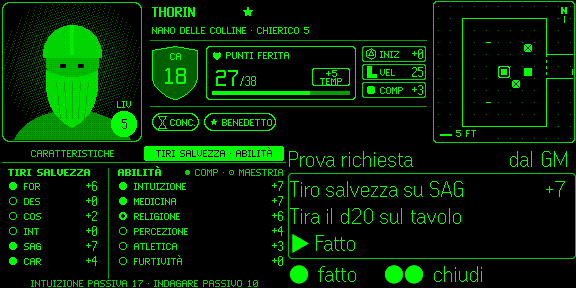
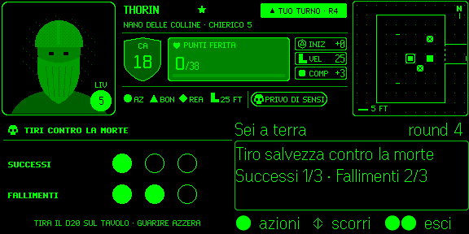
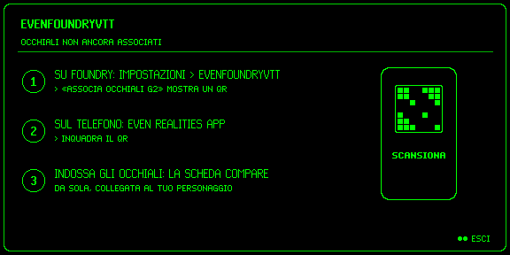
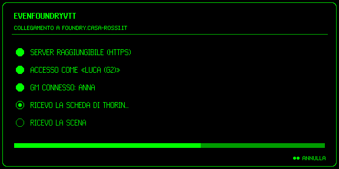
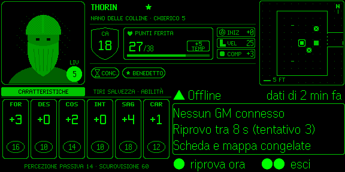

# Schermate S1–S12

Le dodici schermate della «Scheda da tavolo G2», catturate dal **simulatore ufficiale Even Hub 0.9.5** con lo stesso renderer che gira sugli occhiali (576 × 288, 16 livelli). Personaggio d'esempio: **Thorin**, nano delle colline, Chierico 5. Ogni schermata è anche uno scenario demo (`?demo=<nome>`, vedi [Debug e simulatore](Debug-e-Simulatore)).

> La mappa (zona C) in queste immagini è ancora quella schematica; il disegno attuale è l'arte originale pixelata ([Mappa](Mappa)).

## 👓 Esplorazione e combattimento

### S1 · Esplorazione — `explore`

**Quando:** fuori dal combattimento. **Perché:** colpo d'occhio su PF, CA e condizioni; il pannello contesto mostra il registro recente (swipe per scorrere).

### S2 · Combattimento, il tuo turno — `combat-my-turn`

**Quando:** inizia il tuo turno. **Perché:** chip **▲ TUO TURNO · R3**, bordo del ritratto acceso, economia d'azione ● ▲ ◆ e movimento; il contesto mostra l'iniziativa.

### S3 · Azioni — `actions`

**Quando:** tap sulla radice. **Perché:** attacchi con bonus e danni come nella tabella «Attacchi» della scheda cartacea, poi *Incantesimi…*, *Oggetti…*, *Opzioni…*.

### S4 · Bersaglio — `target`

**Quando:** dopo aver scelto un attacco o un incantesimo. **Perché:** il **mirino** compare sulla mappa sul bersaglio sotto il cursore; tap = tira.

### S5 · Incantesimi — `spells`

**Quando:** *Azioni* → *Incantesimi…*. **Perché:** livello e gittata a destra, **C** per la concentrazione, slot rimasti per livello nel titolo.

### S6 · Esito — `result`

**Quando:** Foundry ha risolto l'azione. **Perché:** il d20 tirato da Foundry, *COLPITO* / *MANCATO* e i danni; l'economia d'azione si aggiorna (○ AZ = azione usata). Tap = di nuovo *Azioni*, si chiude da solo dopo 8 s.

### S7 · Reazione — `reaction`

**Quando:** fuori dal tuo turno, Foundry offre una reazione (es. *Attacco di opportunità*). **Perché:** scelta rapida con *scade N s* e l'innesco; doppio tap = *Ignora*.

## 👓 Prove e pericolo

### S8 · Prova richiesta dal GM — `saves`

**Quando:** il GM chiede una prova o un tiro salvezza. **Perché:** la scheda passa a *Tiri salvezza · Abilità*, il contesto dice **«Tira il d20 sul tavolo»** con il bonus; tap = *Fatto*.

### S9 · A 0 punti ferita — `dying`

**Quando:** i PF scendono a 0. **Perché:** ritratto attenuato, i **tiri contro la morte** (3 + 3 cerchi) sostituiscono la scheda.

## 🐞 Stati di connessione

### S10 · Non associato — `unpaired`

**Quando:** l'app non ha credenziali, o l'associazione è stata revocata. **Perché:** mai uno schermo muto — spiega in tre passi come associare ([Associare i tuoi occhiali](Associare-i-tuoi-Occhiali)).

### S11 · Collegamento — `connecting`

**Quando:** all'avvio. **Perché:** i passi del collegamento — server raggiungibile (HTTPS), accesso come «(G2)», GM connesso, scheda, scena; doppio tap = annulla.

### S12 · Offline — `offline`

**Quando:** la connessione cade (nessun projector, rete, credenziali, app in background). **Perché:** la causa, il conto alla rovescia del nuovo tentativo e l'età dei dati; scheda e mappa restano congelate. Tap = *riprova ora*.

## 📚 Vedi anche

- [Leggere la HUD](Leggere-la-HUD) · [Gesti e comandi](Gesti-e-Comandi) · [Risoluzione problemi](Risoluzione-Problemi)
